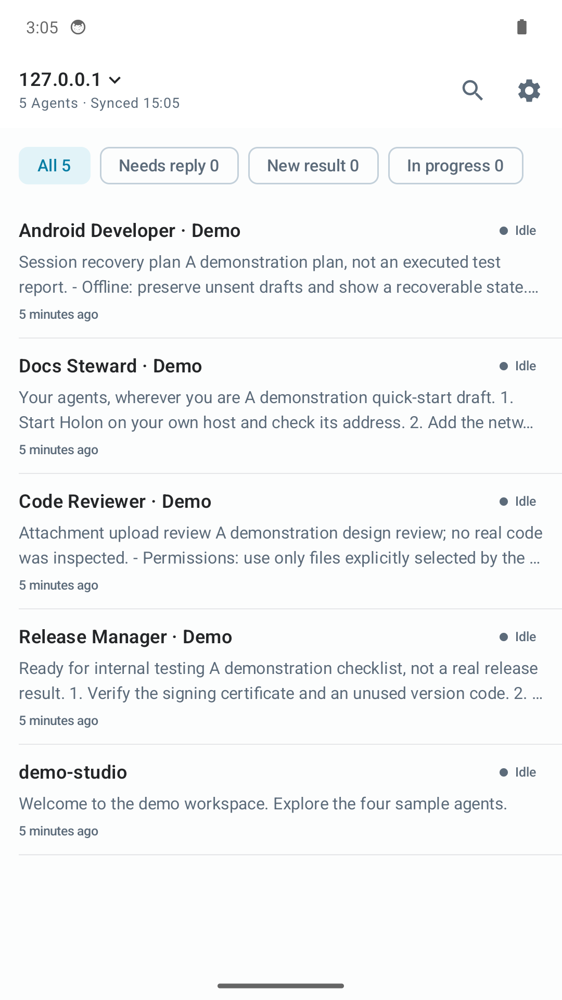
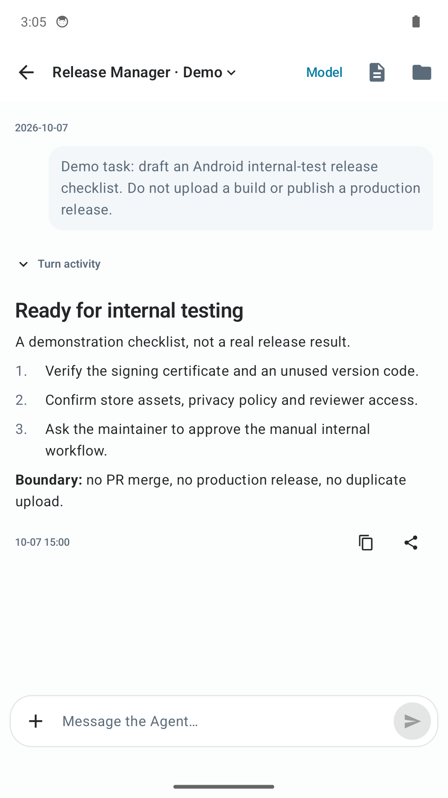
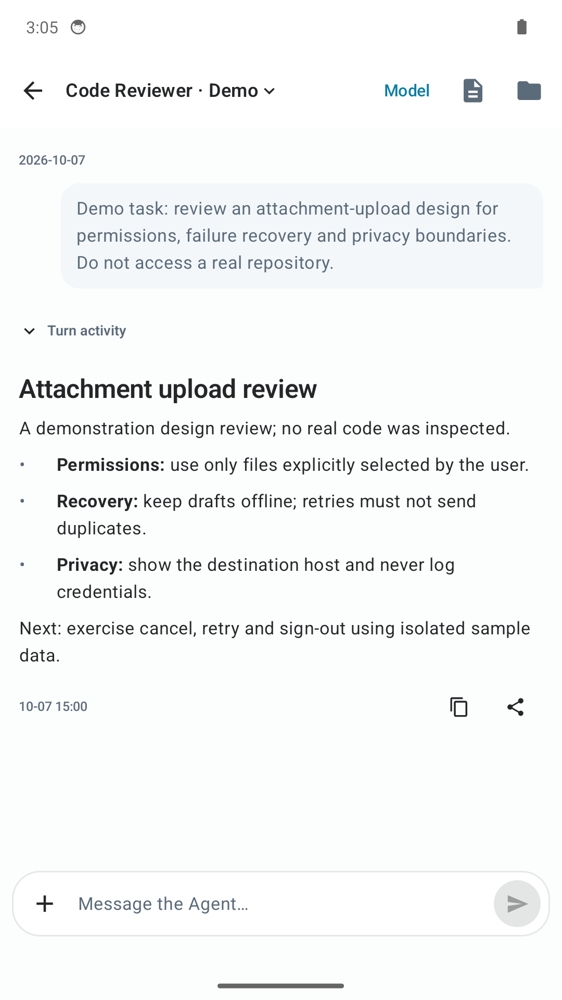
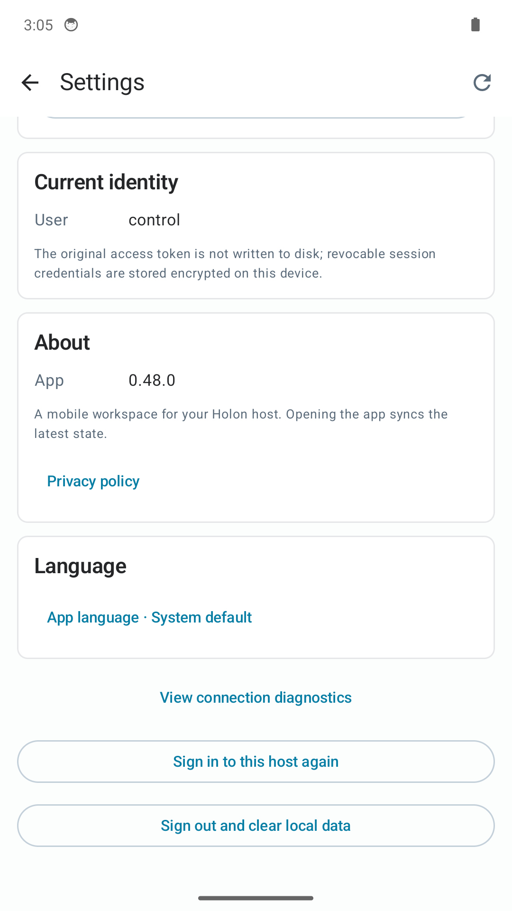
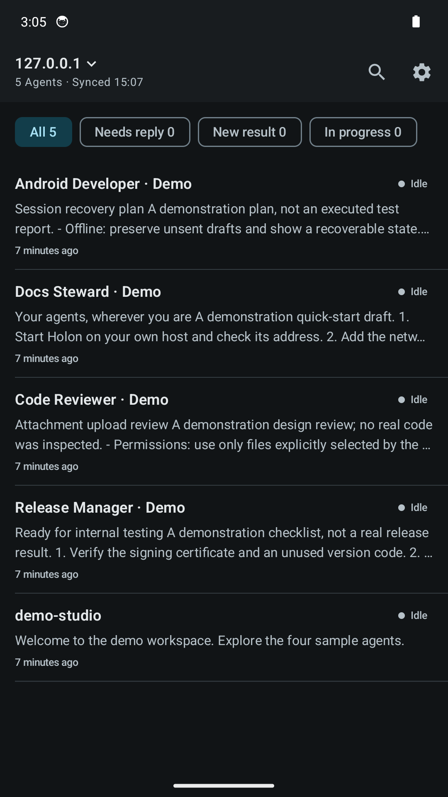
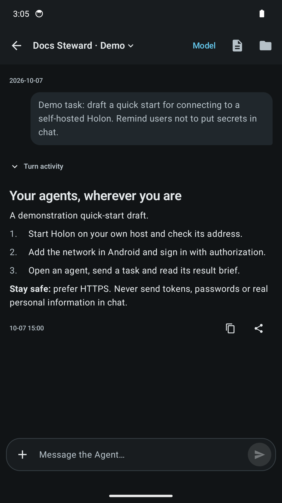
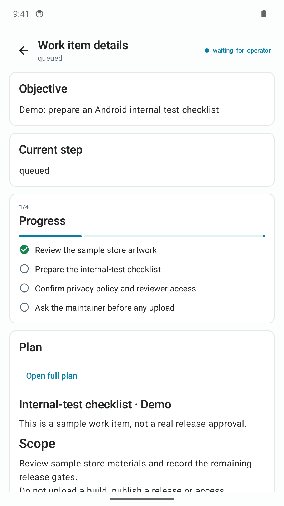
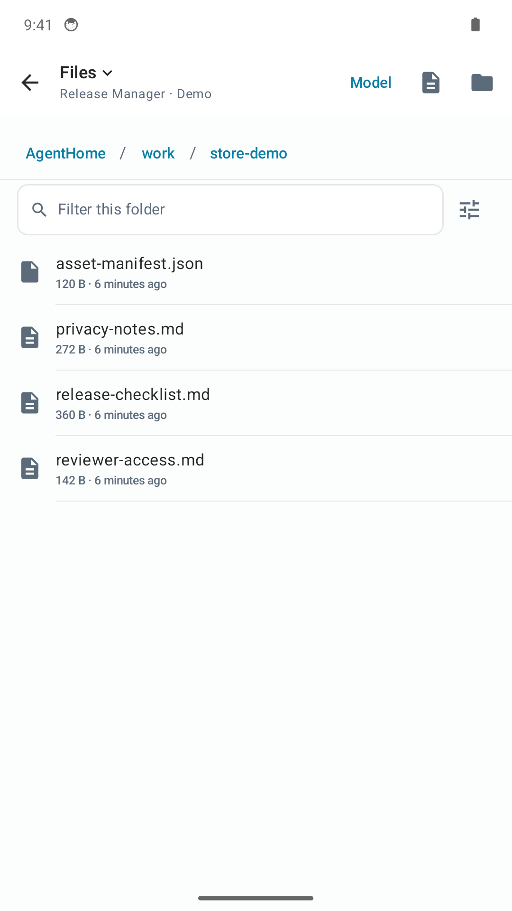
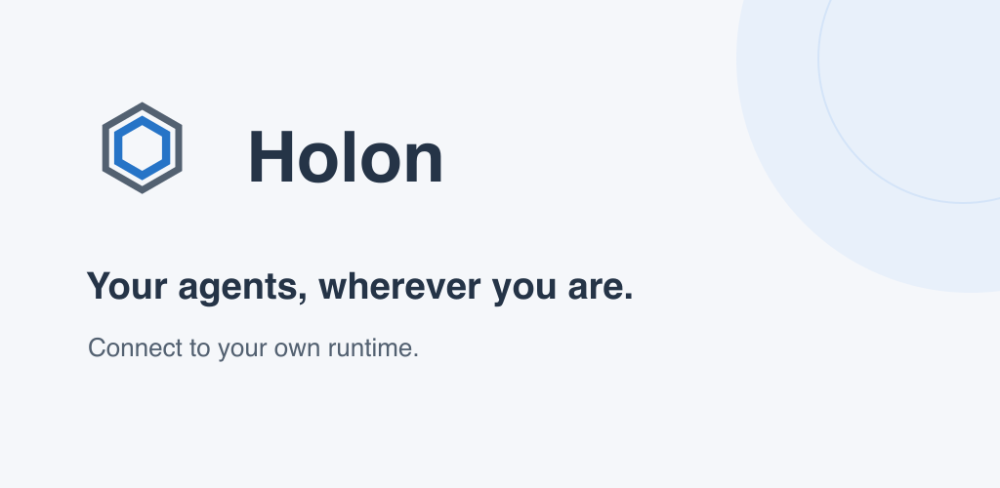

# Android store and article assets

These assets are prepared for the `en-US` listing and can also be reused in
articles. They have **not** been uploaded to Play Console. Confirm the released
UI matches these captures before submitting them.

## Files and provenance

- `en-US/screenshots/`: eight original, unretouched `adb exec-out screencap -p`
  captures, 1080 × 1920 PNG, taken on October 7, 2026.
- `en-US/graphics/icon.png`: 512 × 512 PNG, derived from the Android adaptive
  launcher paths and colors. Editable source: `icon.svg` in the same directory.
- `en-US/graphics/feature-graphic.png`: 1024 × 500 PNG. Editable source:
  `feature-graphic.svg` in the same directory. This is promotional artwork,
  not a screenshot or a simulated app interface.
- `en-US/SHA256SUMS`: checksums for every PNG.

The capture device is a dedicated Android 14 (API 34) Google APIs arm64
emulator, with a 1080 × 1920 display and density 360. The client is a debug
development build of version 0.48.0, including the privacy entry in this change.
It is **not** a capture of the already-published Play build. UI, agent names and
messages are English. Light/dark themes are Android's actual system themes.

The backend is a real Holon 0.48.0 daemon in an independent home, bound only to
loopback. Four named demo agents and their operator messages/result briefs are
persisted through the normal runtime APIs. A local, scripted Responses provider
supplies disclosed demonstration drafts: **no real model inference, production
work, cloud uploads or personal conversations are represented.** Each agent
name/content identifies the demonstration. A fifth default `demo-studio` agent
welcomes users to the capture environment.

The WorkItem and file-browser captures were added in a second isolated run.
The scripted provider calls the real `CreateWorkItem` tool to persist the
sample objective, checklist and plan; `needs_input` prevents an actual release
from running. The four sample files in `AgentHome / work / store-demo` are
written by the capture script and read through the normal authorized file API.
Their content is fictional and contains no account or reviewer credentials.

No access token is included in these images. `control` in Settings is the local
demo session identity, not a personal account. The system status-bar demo mode
was used for presentation; in-app times remain the actual capture times.

## Gallery

### Agent roster — light


### Internal-test checklist


### Design review


### Privacy and settings


### Agent roster — dark


### Quick-start draft — dark


### Work item, checklist and plan


### Agent workspace file browser


### Feature graphic


## Reproduce from the repository root

Use a disposable emulator, never a physical device or an existing user's app
data. Keep demo homes, tokens, APKs and emulator state outside the repository.

1. Start a dedicated real daemon and the local scripted provider:

   ```sh
   python3 scripts/android-store-demo.py --home /path/to/a/new/demo-home \
     --holon /path/to/holon
   ```

   The home must not exist. Default ports are 17980 (Holon) and 17981 (scripted
   provider), both bound to `127.0.0.1`. Provider fallback is disabled. Do not
   expose this capture service as a public reviewer service.
   Stop with Ctrl-C: its owned daemon stops and the temporary token is removed.

2. Build with JDK 21 and the repository's Android SDK requirements:

   ```sh
   apps/android/gradlew -p apps/android :app:assembleDebug
   ```

3. Start a dedicated API 34 emulator; set `DEVICE` to its explicit adb serial.
   Configure its display, install the debug APK and forward only the demo port:

   ```sh
   adb -s "$DEVICE" shell wm size 1080x1920
   adb -s "$DEVICE" shell wm density 360
   adb -s "$DEVICE" install -r apps/android/app/build/outputs/apk/debug/app-debug.apk
   adb -s "$DEVICE" reverse tcp:17980 tcp:17980
   ```

4. Select English in Android or the app's language picker. Sign into
   `http://127.0.0.1:17980/api` using the private `capture-token` in the dedicated
   home. Use only this local disposable token; never put a real credential in
   screenshots, logs, this repository or a PR.
5. Capture the roster, Release Manager and Code Reviewer conversations, and
   Settings → About/Privacy. Open Release Manager → Work items → the demo item
   for its checklist and plan. Open Files → work → store-demo for the sample
   documents. Switch system night mode for the two dark captures.
   Keep keyboards, model menus and credential fields closed:

   ```sh
   adb -s "$DEVICE" exec-out screencap -p > /path/to/capture.png
   adb -s "$DEVICE" shell cmd uimode night yes
   ```

6. Inspect every image for English copy, legibility and secrets before replacing
   these files. Stop the dedicated daemon and emulator after capture. Remove
   only their disposable state; retain this asset directory and script.

Regenerate graphics with `rsvg-convert`, then check PNG dimensions and refresh
checksums:

```sh
rsvg-convert apps/android/play/en-US/graphics/icon.svg \
  -o apps/android/play/en-US/graphics/icon.png
rsvg-convert apps/android/play/en-US/graphics/feature-graphic.svg \
  -o apps/android/play/en-US/graphics/feature-graphic.png
magick identify apps/android/play/en-US/{graphics,screenshots}/*.png
(cd apps/android/play/en-US && shasum -a 256 graphics/*.png screenshots/*.png > SHA256SUMS)
```

For privacy, data-safety, audience and reviewer-access gates, see
[the compliance record](../PLAY_COMPLIANCE.md) and
[the publishing workflow](../PLAY_PUBLISHING.md). Asset preparation does not
submit those declarations or release the application.
