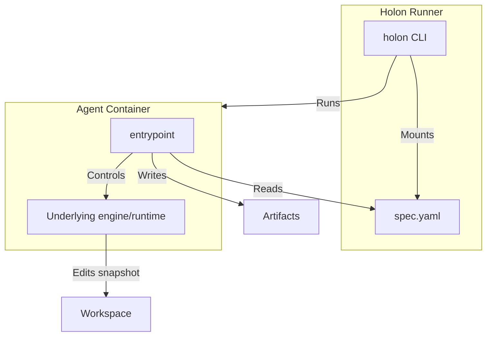

# Agent Encapsulation Scheme (Design Notes)

This document is **non-normative**. The normative agent/runner contract is in `rfc/0002-adapter-scheme.md`.

## The agent pattern
An **agent** is a container entrypoint that bridges the Holon filesystem contract (`/holon/input`, `/holon/workspace`, `/holon/output`) to an underlying AI engine/runtime.

## Responsibilities
- **Runner**:
  - prepares `/holon/input/*` and a workspace snapshot at `/holon/workspace`
  - injects credentials via environment variables
  - runs the agent bundle in a composed image and validates required artifacts
  - publishes results (apply patch, create/update PR) outside the agent
- **Agent**:
  - reads `spec.yaml` and context
  - drives the tool/runtime headlessly
  - writes standard artifacts to `/holon/output`

## Image composition: base + agent bundle
Real tasks need language/toolchain images (Go/Node/Java/etc.). To avoid maintaining a prebuilt agent×toolchain matrix, Holon can compose a final image at run time:
- **Base image**: project toolchain (`golang:1.22`, `node:20`, ...)
- **Agent bundle**: agent entrypoint + dependencies

This is an implementation strategy (runner-side) and can evolve without changing the contract.

## Workspace isolation (atomicity)
Holon prefers a “patch-first” integration boundary:
- agents operate on a workspace **snapshot** (not your original checkout),
- code changes flow out as `diff.patch`,
- callers/workflows explicitly apply changes back to a branch/PR.

## Reference implementations
- Claude agent: `docs/adapter-claude.md`
