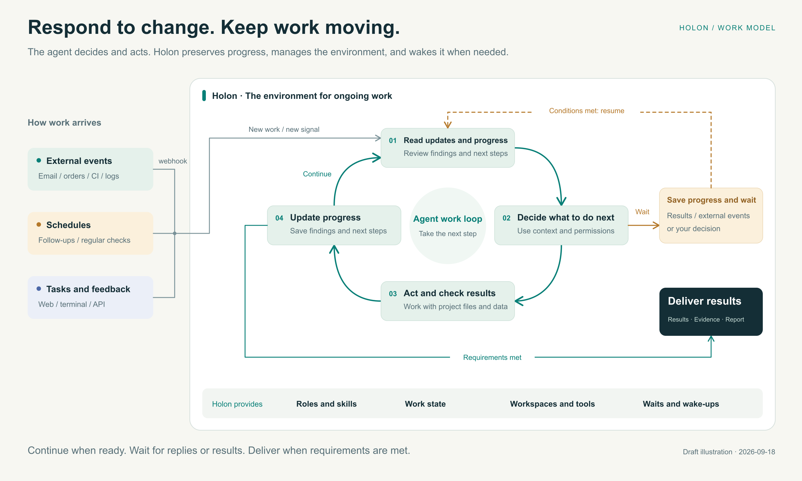
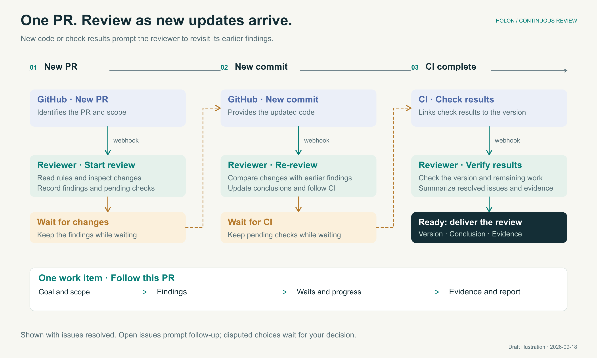
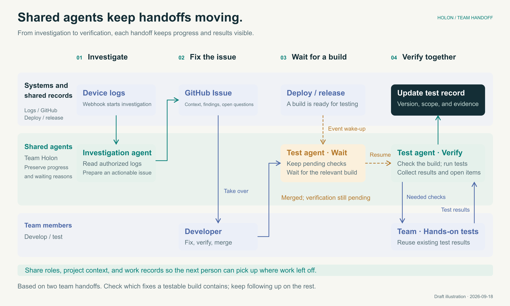
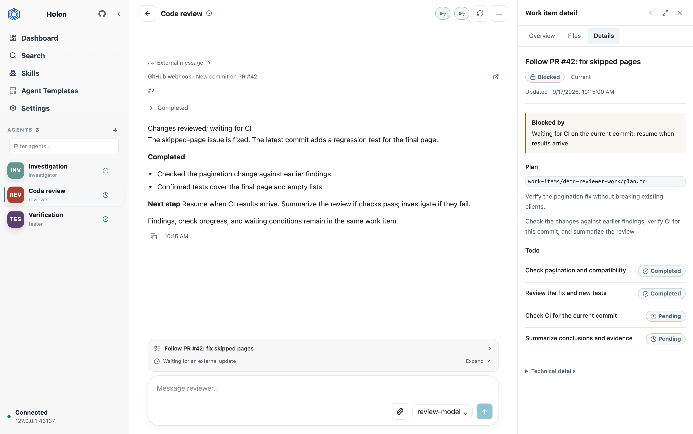

# Holon: Agents that act and follow through

**Create and manage AI agents with ongoing responsibilities.**

Give an agent work such as sorting incoming mail, following up on order issues, investigating problems, or reviewing code. You set the goal and requirements; it uses tools to do the work, saves progress while waiting, and continues when the conditions are met.

**Act on changes and schedules**\
Once connected, new emails, order updates, or an agreed time can prompt the agent to act.

**Keep progress and follow through**\
Goals, findings, and next steps stay with the work. Replies and new results let it pick up where it left off.

**Check in and guide the work**\
See progress, add context, or change direction. When a decision needs your judgment, the agent asks you.

## What Holon provides

### Act on changes and schedules

| Feature | What it does | Why it helps |
| --- | --- | --- |
| **External events** | Receives messages through Webhooks, or signals an agent to check for updates | Mail and order changes can start work without someone forwarding each update |
| **Scheduled tasks** | Runs at an agreed time or checks at regular intervals | Follows up, monitors, and summarizes without repeated reminders |
| **Progress-aware follow-up** | Reads its role, findings, and next steps when a message arrives | Continues the same work without starting the explanation over |

Integration depends on the source system. Webhook support allows direct notifications; reading mail, filtering content, or converting formats requires suitable tools or adapters. The agent then considers the change alongside existing progress.

### Reuse roles and working methods

| Feature | What it does | Why it helps |
| --- | --- | --- |
| **Persistent agents** | Keeps each agent's role, memory, and work records | Supports ongoing responsibilities with accumulated context |
| **Agent templates** | Creates agents from role instructions and skill settings; templates can be customized and shared | Reuses a role without configuring it from scratch |
| **Skills per agent** | Manages reusable methods and enables or disables them for each agent, to be read as needed | Gives each role its own methods, adjustable independently |
| **Model choice** | Sets a default model, with optional choices per agent | Matches the model and provider to the task |

For example, a template can define a support role, skills can explain how to classify and answer requests, and "follow up on this return request" is one work item. **Templates define roles; skills describe methods; work items record goals and progress.** This is a configuration example, requiring the relevant business integrations.

### Keep progress while waiting; leave evidence on completion

| Feature | What it does | Why it helps |
| --- | --- | --- |
| **Work items** | Records each task's goal, plan, checklist, waiting reasons, and completion report | Shows what is done, what is holding it up, and what counts as complete |
| **Wait and resume** | Tracks pending execution results, replies, and external conditions | Continues the same work when those conditions are met |
| **Delegation and tracking** | Assigns tasks to subagents, tracks progress and results, and allows additional input or cancellation | Keeps ownership, progress, and results visible |
| **Inspectable results** | Preserves message sources, tool activity, and completion reports | Lets you read the conclusion first and inspect the evidence when needed |

### Organize the working environment

| Feature | What it does | Why it helps |
| --- | --- | --- |
| **Workspaces** | Lets one agent use multiple workspaces and switch between them | Works across project files and directories toward one goal |
| **Separate code directories** | Uses Git worktree to create independent coding directories | Supports parallel changes, experiments, and reviews |
| **Web and terminal** | Connects Web and TUI interfaces to one service, with CLI and HTTP API access too | Lets you return to the same agents and work through your preferred interface |
| **Self-hosting** | Bundles the Web interface with the binary for a personal computer or server | Needs no separate frontend deployment and can serve a remote team |

Choose who owns the work, which files and tools they use, and how to inspect progress and results.

## A reviewer that follows through

**For individual developers and teams that need ongoing code review.**

Create a review agent from a template, configure skills, a project workspace, and GitHub events, then give it an ongoing responsibility:

> Review this repository's pull requests (PRs), focusing on compatibility and regressions. Follow up when code changes or automated checks (CI) finish. Ask me about disputed trade-offs. Keep a conclusion and supporting evidence for each PR.

For example, CI can send its result and the relevant PR through a Webhook. On failure, the agent investigates; on success, it checks for any remaining issues.

**Each PR has its own work record.** When revised code arrives, the agent checks it against earlier findings. It follows up on unresolved issues and delivers a report once the requirements are met.

Close the terminal and return later through a browser. While the host and Holon's background service remain running, the agent can keep receiving updates and following up.

*Illustrative workflow. Automatic GitHub updates require tools, account permissions, and event integration. You can also supply new results manually. Publishing or merging code requires authorization.*

## Give shared agents a role in the team

Run Holon on a team server. Shared agents can own investigation, review, or acceptance testing. Members use a browser or terminal to see the same progress, add context, or take over.

[A four-person AI hardware team's experience](../website/blog/agents-in-a-small-team.md) illustrates two handoffs:

**Investigation agent: turn field evidence into an actionable issue.** It organizes device logs and findings into an issue that a developer can work on.

**Testing agent: follow a fix through to verification.** After code merges, it keeps the pending checks. Once a build containing the fix is testable, it runs automated checks and brings together the team's hands-on results.

**The team can see who is following up, what has changed, and what is needed next.** Findings and next steps survive a handoff. Work waiting for a deployment or reply resumes when results arrive.

Scheduled checks can also identify which fixes are ready to test, which are still waiting, and which need someone to retest them.

*The diagram combines two handoffs from the team's account, not one measured end-to-end run. Scheduled checks are a configuration example. Logs, GitHub, and release systems require integration and access permissions.*

## Put your first agent to work

Start with one concrete task, then add events and schedules as needed.

**1. Create from a template.** Choose an Agent Template to reuse a role and its working methods.

**2. Define responsibilities.** State what it owns, what to deliver, and when to ask you. Choose skills and the files and systems it may access.

**3. Assign a task.** Provide the goal, materials, and completion criteria. Review progress, add context, and make decisions when needed.

**4. Connect updates and schedules.** Receive business messages through Webhooks or adapters, or schedule regular follow-ups.

*Workbench shown with demo data. Choose an agent on the left, read updates in the center, inspect the plan and waiting reason on the right, and add input below. A terminal interface connects to the same service.*

Run Holon on your computer or a team server; the Web interface is included. Configure a model, tools, and workspace. Keep the host and background service running for ongoing follow-up.

**Get started:** [Installation and quick start](../website/getting-started/README.md) · [Source code](https://github.com/holon-run/holon) · [Documentation](https://holon.run)

**Questions and feedback:** [hello@holon.run](mailto:hello@holon.run)
