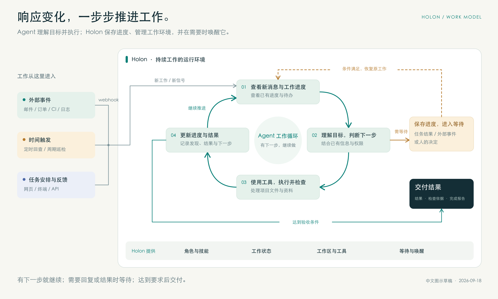
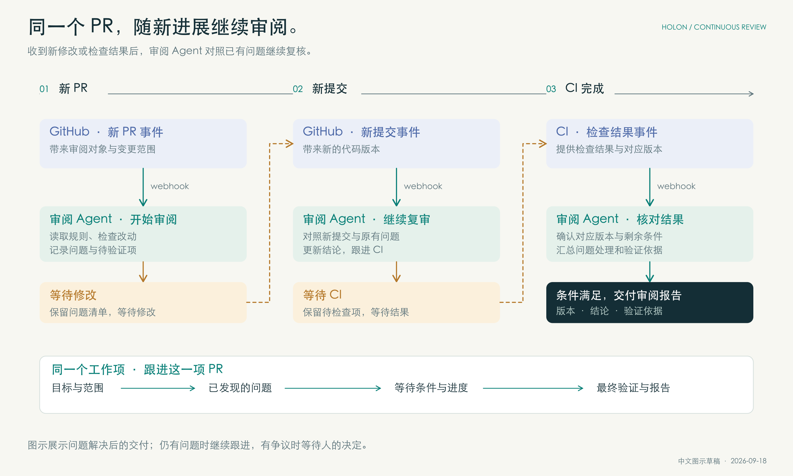
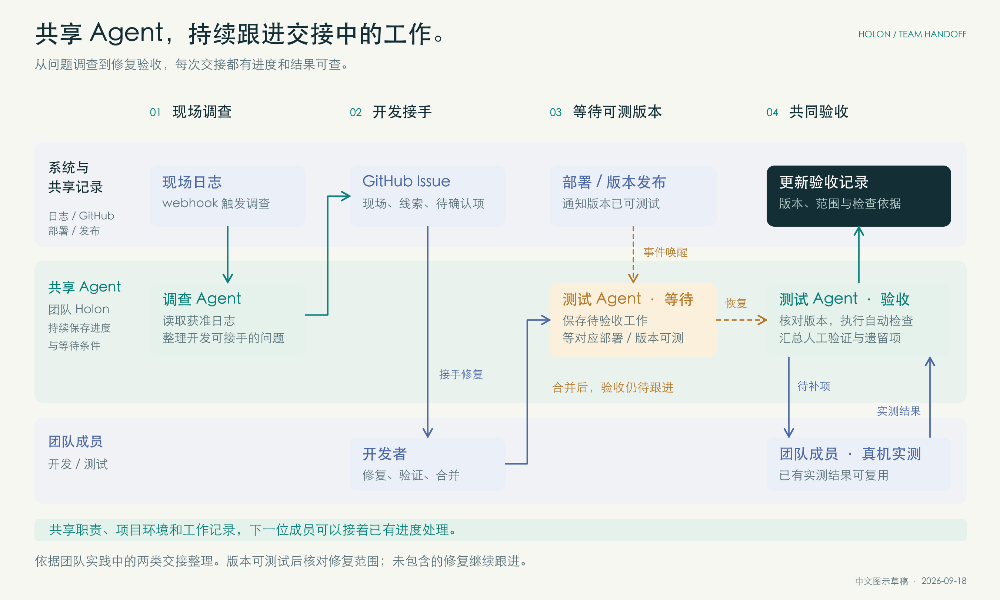
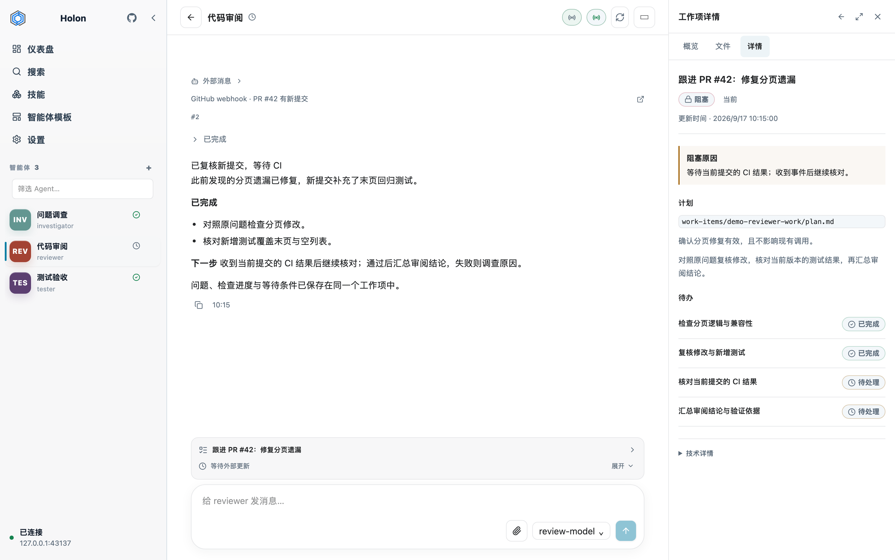

# Holon：让 Agent 主动工作，持续跟进

**创建和管理 AI Agent，让它们按职责持续工作。**

把来信分拣、订单异常跟进、问题调查或代码审阅交给 Agent。你设定目标和要求，它使用工具处理工作；需要等待回复或结果时保留进度，条件满足后继续。

**响应变化，按时行动**\
接入相关系统后，新邮件到达、订单状态变化，或到了约定时间，都可以让 Agent 开始处理工作。

**保留进度，继续跟进**\
目标、发现和待办都保留下来，收到回复或新的结果后，接着原来的工作继续处理。

**随时查看，按需介入**\
查看进度、补充信息、调整方向；需要你判断时，Agent 把问题交回来。

## Holon 提供什么

### 响应变化，按时行动

| 特性 | 具体功能 | 使用价值 |
| --- | --- | --- |
| **外部事件触发** | 通过 Webhook 接收系统消息，或提醒指定 Agent 回查最新情况 | 邮件、订单等发生变化时开始处理，无需每次人工转交 |
| **定时与周期任务** | 在约定时间执行，或按设定周期重复检查 | 按时跟进、巡检和汇总，减少人工提醒 |
| **结合进度持续处理** | 处理新消息时，查看职责、已有发现与待办 | 跟进同一件事，无需每次重新交代背景 |

接入方式取决于业务系统：支持 Webhook 的系统可以直接发送通知；邮件读取、内容筛选或格式转换，需要配置相应工具或适配器。接入后，Agent 根据变化和已有进度决定下一步。

### 角色与工作方法可以复用

| 特性 | 具体功能 | 使用价值 |
| --- | --- | --- |
| **长期保留的 Agent** | 每个 Agent 分别保存职责、记忆和工作记录 | 持续承担同一类工作，积累经验与记录 |
| **Agent 模板** | 按角色说明和技能配置创建 Agent；模板可自定义和共享 | 复用已有的角色设定，不必每次从头配置 |
| **按 Agent 管理技能** | 在技能库中管理工作方法，为各 Agent 单独启用或停用，任务中按需读取 | 不同角色使用各自需要的方法，可分别调整 |
| **模型选择** | 设置默认模型，也可为不同 Agent 单独选择 | 根据任务需要选择模型及服务商 |

例如，可以用模板设定客服 Agent 的职责，用技能说明问题分类和回复方法，而“跟进这次退货咨询”是一项具体工作。**模板（Template）定义角色，技能（Skills）说明方法，工作项记录一件事的目标和进度。** 这是配置示例，实际处理仍需接入相应业务系统。

### 等待时保留进度，完成后留下依据

| 特性 | 具体功能 | 使用价值 |
| --- | --- | --- |
| **工作项（WorkItem）** | 分别记录每件事的目标、计划、待办、等待原因和完成报告 | 看清做到哪里、为什么停下、怎样才算完成 |
| **等待与继续** | 记录正在等待的执行结果、人的回复，以及其他外部条件 | 条件满足后继续原来的工作，不必重新开始 |
| **任务分派与跟踪** | 将任务交给子 Agent，跟踪状态、查看结果，也可补充信息或停止执行 | 知道工作交给了谁、进展如何、结果在哪里 |
| **过程与结果可查** | 保留消息来源、工具操作记录和完成报告 | 先看结论，需要时再核对处理过程与依据 |

### 按需要组织工作环境

| 特性 | 具体功能 | 使用价值 |
| --- | --- | --- |
| **工作区（Workspace）** | 一个 Agent 可使用多个工作区，按任务切换当前工作位置 | 为同一目标处理不同项目或目录中的资料 |
| **独立代码目录** | 通过 Git worktree 为编码任务创建独立目录 | 方便同时修改代码、试验方案或审阅改动 |
| **网页与终端界面** | Web 与 TUI 连接同一后台，也提供命令行和 HTTP API | 按习惯选择入口，随时回到已有 Agent 和工作 |
| **自行部署** | 安装包自带网页界面，可部署在自己的电脑或服务器上 | 无需单独部署网页服务，也可供团队远程使用 |

你可以决定由谁负责、使用哪些项目资料和工具，并查看工作进度与结果。

## 一个持续负责审阅的 Agent

**适合：个人开发者，以及需要持续跟进代码质量的团队。**

从审阅模板创建代码审阅 Agent，配置技能、项目工作区和 GitHub 事件，再给它一项持续职责：

> 负责这个仓库的代码变更请求（PR）审阅。收到新 PR 后开始检查，重点关注兼容性和回归风险；有新修改或自动检查（CI）结果时继续跟进。有争议的取舍等我决定，为每个 PR 留下审阅结论和验证依据。

例如，CI 检查结束后，通过 Webhook 把结果和对应的 PR 告诉 Agent。检查失败时，它调查原因；检查通过时，它核对是否还有未解决的问题。

**每个 PR 都有独立的工作记录。** 修改后的代码到来时，Agent 对照原有问题复核；仍有问题就继续跟进，满足要求后交付报告。

你可以关闭终端，稍后从浏览器回来查看。只要运行 Holon 的电脑或服务器及其后台服务保持运行，Agent 就能继续接收变化并跟进工作。

*本例为流程示意。自动接收 GitHub 变化需要配置工具、账号权限和事件接入，也可以先手动提供新结果。发布或合并代码需获得相应授权。*

## 把共享 Agent 纳入团队分工

将 Holon 部署到团队服务器，让共享 Agent 承担调查、审阅和验收等职责。成员通过网页或终端查看同一份进度，补充信息或接手处理。

[一个四人 AI 硬件团队的实践](../website/zh-CN/blog/agents-in-a-small-team.md)展示了两类交接：

**调查 Agent：把现场线索整理成可接手的问题。** 收到设备日志后，Agent 整理线索，写入问题记录（Issue），供开发者处理。

**测试 Agent：跟进修复是否真正可用。** 代码合并后，保留待验收事项；包含修复的版本可测试时，执行自动检查，汇总团队成员的实测结果。

**团队可以随时查看谁在跟进、进展如何、下一步需要什么。** 换人接手时，已有线索和待办仍在；等待部署或人的反馈时保留进度，收到结果后继续。

还可以安排定期检查：哪些修复已经可以测试，哪些仍在等待，哪些需要团队成员补测。

*图示汇集实践记录中的两类交接，并非一次完整流程的实测；定期检查为配置示例。日志、GitHub 和发布系统需配置接入与访问权限。*

## 把第一个 Agent 放进你的工作流

先交给 Agent 一项具体工作，再按需要接入事件和定时任务。

**1. 从模板创建。** 选择合适的 Agent 模板（Agent Template），复用角色设定和工作方法。

**2. 定义职责。** 写清负责什么、交付什么、什么时候需要你决定。选择所需技能，并明确它可以访问哪些资料和系统。

**3. 安排任务。** 给出目标、材料和完成要求。执行后，查看进度、补充信息，并处理需要你决定的问题。

**4. 接入变化与时间安排。** 通过 Webhook 或适配器接收业务系统的消息，或设置定时检查，让 Agent 按约定跟进。

*工作台界面，内容为演示数据。左侧选择 Agent，中间查看消息与进展，右侧查看计划和等待原因；底部补充信息。也可通过终端界面接入同一个后台。*

Holon 可部署在个人电脑或团队服务器上，自带网页界面。使用前配置模型、工具和工作区；持续跟进时，让这台机器和 Holon 后台保持运行。

**开始使用：** [安装与快速开始](../website/zh-CN/getting-started/README.md) · [项目源码](https://github.com/holon-run/holon) · [文档](https://holon.run)

**交流与反馈：** [hello@holon.run](mailto:hello@holon.run)
