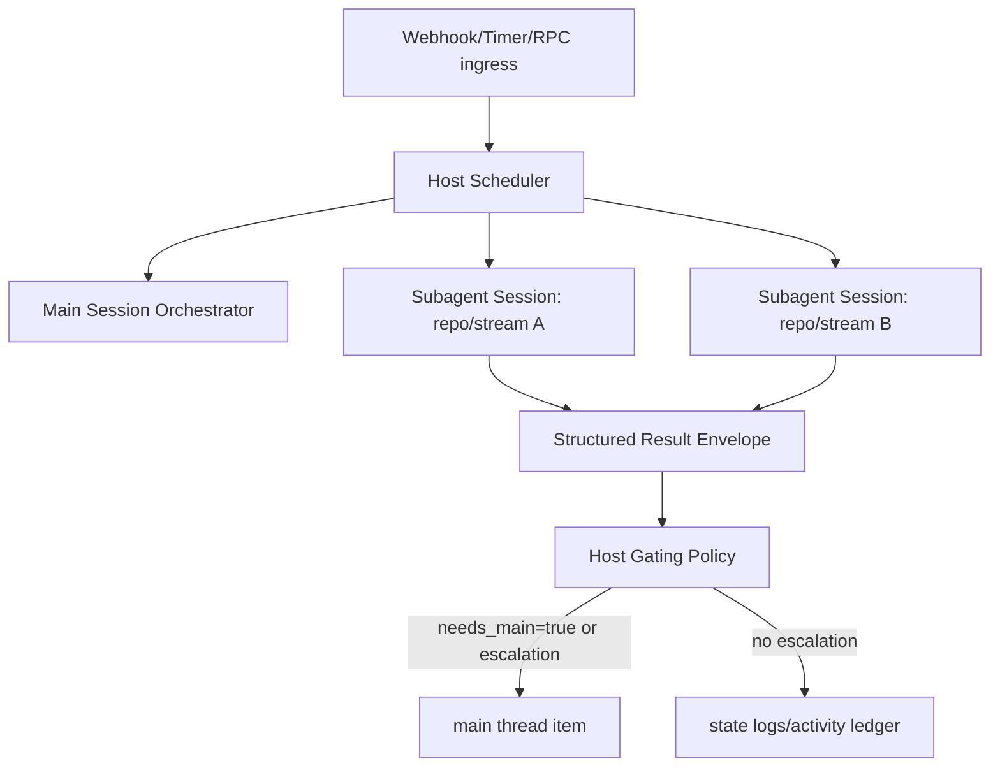

# Serve 模式 Subagent 分层会话架构设计 (Scheme B)

## 1. 目标

在不牺牲可追踪性和交互响应性的前提下，解决当前 `serve` 模式的两类问题：

1. 事件已处理但 `main` 线程不可见或可见性不稳定。
2. `main` 上下文被高频 webhook 噪音污染，影响用户交互质量。

本方案采用：
- `main` 作为控制平面与决策中枢（orchestrator）
- `subagent` 作为事件执行平面（worker）
- 结构化汇报替代自由文本 announce

## 2. 设计原则

1. 用户交互优先：`main` 线程始终优先服务 RPC turn。
2. 事件隔离执行：外部事件在 subagent 会话中处理，避免污染 `main` 对话历史。
3. 汇报可判定：subagent 返回结构化结果，由 host 决定是否投递到 `main`。
4. 全链路可追踪：任意一条 `main` 可见消息都能反查到原始 `event_id` 与执行记录。

## 3. 逻辑架构



说明：
- `main` 不直接消费全部 webhook payload。
- `subagent` 处理后返回结构化决策信号。
- 是否进入 `main` 由 host 规则判定，不由 LLM 自由文本“猜测”。

## 4. 会话与线程映射

### 4.1 控制面身份

- `thread_id`：继续作为用户可见线程标识（TUI/RPC 语义不变）。
- `session_key`：
  - `main`：仅用于用户交互与高优先级控制事件。
  - `sub:<lane>`：用于事件执行会话（例如 `sub:repo:jolestar/uxc`）。

### 4.2 路由规则（建议）

1. `rpc.turn.input` -> `session_key=main`
2. `github/*`、`timer.tick` -> `session_key=sub:<lane>`
3. `main` 是否收到该事件的可见摘要由 gating 决定，而不是总是桥接。

`<lane>` 建议稳定可复现，按以下优先级生成：
1. 显式 `payload.session_key`
2. `scope.repo`
3. `source + type`

## 5. 结构化汇报契约（Result Envelope）

subagent 每次处理事件后，host 侧统一保存并用于判定：

```json
{
  "event_id": "evt_xxx",
  "session_key": "sub:repo:jolestar/uxc",
  "status": "completed|failed|interrupted|skipped",
  "decision": "act|observe|escalate|noop",
  "action": "open_pr|comment|retry_ci|none",
  "needs_main": true,
  "summary": "short human-readable summary",
  "artifact_refs": ["holon-output/summary.md", "holon-output/diff.patch"],
  "error_code": "",
  "error_message": "",
  "completed_at": "2026-02-22T09:00:00Z"
}
```

约束：
- `decision/action/needs_main` 为必填。
- `summary` 长度受限，防止日志污染。
- `artifact_refs` 必须为可解析的本地路径或 workspace 相对路径。

## 6. Main 投递策略（Gating）

仅当满足以下任一条件，才向 `main` 投递 `item/created`：

1. `needs_main=true`
2. `status in [failed, interrupted]`
3. `decision=escalate`
4. 命中关键事件类型（例如 PR 合并失败、CI 持续失败、需要人工审批）

不满足条件时：
- 不投递 `main` timeline
- 仅写入 activity ledger + `actions.ndjson`

这能保证“main 看到的都是有行动价值的事件”。

## 7. 调度与抢占

队列采用优先级：
- `P0`: RPC 用户 turn（`main`）
- `P1`: 需要升级到 `main` 的事件
- `P2`: 普通 webhook/timer 事件

抢占策略：
1. 当 `P0` 到达时，允许对运行中的 `P2` 发起 cancel/interrupt。
2. `P1` 不抢占 `P0`，但可优先于 `P2`。

## 8. 可观测性与排障键

新增统一关联键：
- `event_id`
- `subagent_run_id`
- `session_key`
- `source_session_key`
- `main_item_id`（若投递）

建议新增：
- `controller-state/activity-ledger.ndjson`：记录所有 Result Envelope 与 gating 结果。

排障时应能回答：
1. 事件是否处理过？
2. 处理结果是什么？
3. 为什么没有（或有）出现在 `main`？

## 9. 与当前实现的兼容迁移

### Phase 1: 引入结构化汇报，不改默认路由

1. 保留当前 `routeEventToSessionKey`。
2. 在 `dispatchQueuedEvent` 后落盘 Result Envelope。
3. 新增 gating 判定日志（即便还未替换 announce）。

验收：
- 每个 `actions.ndjson(status=ok|failed)` 都有对应 Result Envelope。

### Phase 2: 引入 `sub:<lane>` 并替换 announce

1. 新事件默认路由到 `sub:<lane>`。
2. 将 `session.announce` 逐步替换为“gating 后直接 main item 推送”。
3. `maybeEmitSessionAnnounce` 进入兼容模式并记录 deprecation。

验收：
- `main` 中只出现命中 gating 的事件。
- “处理过但 main 不可解释”问题可通过 ledger 明确归因。

### Phase 3: 压缩与清理

1. 移除 announce 旧路径。
2. 缩减仅为 announce 服务的状态分支。
3. 保留 `main/sub` 双层模型，不强制收敛到单一会话。

验收：
- 响应延迟不劣于基线。
- main 上下文长度增长速率显著低于 Scheme A（统一单会话）。

## 10. 风险与边界

1. Subagent 会话数量膨胀：
   - 需设置 `max_subagent_sessions` 与 LRU 回收。
2. 事件风暴导致堆积：
   - 需配置 webhook 白名单与按类型限流。
3. 结构化字段缺失：
   - host 端必须有默认值与降级判定，不能依赖模型“总是格式正确”。

## 11. 结论

与 “全部收敛到 `main`” 相比，Scheme B 更适合当前 Holon 的自主自动化场景：

- 保留事件执行隔离，避免主对话污染。
- 通过结构化汇报和 gating，提升 `main` 可见性的确定性。
- 迁移可渐进，风险更低，便于线上验证与回滚。

## 12. 代码改动清单（按文件）

### 12.1 `cmd/holon/serve.go`

1. 新增 `deriveSubagentLane(env)`，输出 `sub:<lane>`。
2. `HandleEvent` 中：
   - `rpc.turn.input` 强制 `sessionKey=main`
   - 非 RPC 事件默认 `sessionKey=sub:<lane>`
3. `dispatchQueuedEvent` 完成后写入 `activity-ledger.ndjson`。
4. 用 gating 直接触发 main 可见通知，逐步替代 `enqueueMainAnnounce`。
5. `postEventRPC` 请求中始终显式传 `session_key`，不依赖容器端 fallback 推断。

### 12.2 `pkg/serve/webhook.go`

1. 保留 `event/received` ingress 通知。
2. 将 `maybeEmitSessionAnnounce` 改为兼容路径（可配置开关）。
3. 新增 `emitMainActivityFromLedger(record)`，只消费命中 gating 的记录。

### 12.3 `agents/claude/src/agent.ts`

1. 强化 `/v1/runtime/events` 入参约束：缺失 `parsed.session_key` 时可拒绝（strict mode）。
2. `sessionKey` 解析优先级固定为：
   - `request.session_key`（必选）
   - 兼容模式下才允许 `deriveSessionKeyFromEvent`
3. 保留 `ensureSessionReady(sessionKey)` + `Map<string, SessionEntry>`，作为 subagent 会话池。
4. `toResponse(record)` 保持回传 `session_key`，便于 host 侧核对投递命中目标会话。

## 13. Claude Agent SDK 精确投递到 Subagent

本节定义“精确投递”语义：某 event 必须进入指定 subagent 会话，不允许被 fallback 到其他会话。

### 13.1 请求协议（Host -> Controller RPC）

`POST /v1/runtime/events` 请求体要求：

```json
{
  "session_key": "sub:repo:jolestar/uxc",
  "event": {
    "id": "evt_1771749956183343000_58",
    "source": "github",
    "type": "github.issue.comment.created",
    "scope": {
      "repo": "jolestar/uxc",
      "partition": "jolestar/uxc"
    },
    "subject": {
      "kind": "issue",
      "id": "25"
    },
    "payload": {
      "session_key": "sub:repo:jolestar/uxc",
      "thread_id": "main"
    }
  }
}
```

要求：
1. 顶层 `session_key` 必填且与 `payload.session_key` 一致。
2. `event.id` 必填，用于幂等去重与状态查询。
3. `thread_id` 仅用于 UI/turn 语义，不参与 subagent 路由决策。

### 13.2 容器端会话命中逻辑（`agent.ts`）

当前实现中，`sessionKey = request.session_key || deriveSessionKeyFromEvent(event) || "main"`。

建议改为：
1. 默认开启 strict（新部署）。
2. strict 下必须有 `request.session_key`，否则 `400 missing session_key`。
3. 仅当兼容开关启用时，才允许 `deriveSessionKeyFromEvent` fallback。

这样可以避免“host 以为发给 subagent，容器实际落到 main/event:*”的不确定性。

### 13.3 与 Claude Agent SDK 的关系

`runServeQueryTurn(...)` 通过 `options.resume = entry.sessionID` 将每个 `session_key` 绑定到独立 Claude 会话：

1. `ensureSessionReady(sessionKey)` 取到该 key 的 `SessionEntry`。
2. 若有历史 `sessionID`，SDK query 走 resume，命中对应 subagent 上下文。
3. 首次无 `sessionID` 时，turn 完成后从 SDK 消息里提取 `session_id`，写回该 key。
4. 会话映射持久化在 controller session state（`sessions[key] = sessionID`）。

因此，“精确投递”的关键不在 SDK 本身，而在 host->RPC 的 `session_key` 严格传递和校验。

### 13.4 精确投递验收标准

1. 给定同一 `session_key` 的连续事件，返回的 `session_id` 稳定（除主动 reset）。
2. 给定不同 `session_key` 的事件，`session_id` 不应串线。
3. 日志中可按 `event_id -> session_key -> session_id` 一跳追踪。
4. strict 模式下，缺失 `session_key` 的请求必失败，不得隐式落到 `main`。

## 14. 建议新增配置开关

1. `HOLON_CONTROLLER_STRICT_SESSION_KEY=true|false`
2. `HOLON_SERVE_ENABLE_LEGACY_ANNOUNCE=true|false`
3. `HOLON_SERVE_MAIN_GATING_POLICY=<policy-name>`
4. `HOLON_SERVE_MAX_SUBAGENT_SESSIONS=<n>`

推荐默认值（新环境）：
- strict session key: `true`
- legacy announce: `false`
