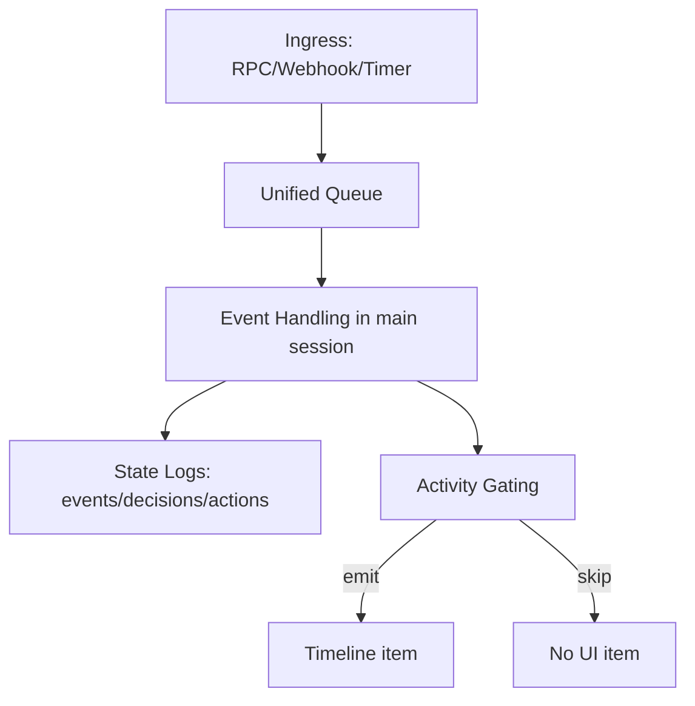

# Serve 单 Session 统一架构设计 (Unified Main Session)

## 1. 背景

当前 `serve` 机制的核心问题不是“模型不会处理事件”，而是“处理链路与可见链路分裂”：

1. 事件处理发生在非 `main` 路由通道时，用户在主时间线不一定看得到。
2. “announce/转发到 main”引入二次桥接，语义与排障成本都高。
3. 多 session 路由在现阶段增加了调试复杂度，不利于稳定演进。

本设计将 `serve` 收敛为：**一个会话（main）+ 一条事件处理链路 + 一套 activity 展示策略**。

## 2. 目标与非目标

### 2.1 目标

1. 单会话：所有事件与用户输入都由 `main` session 处理。
2. 行动优先：优先保证 agent 真正执行动作（开 PR、评论、修 CI）。
3. 可见性清晰：不再“投递到 main”，改为“是否发出 activity item”。
4. 最小结构化：只保留排障必需字段，不强求模型输出严格 JSON。

### 2.2 非目标

1. 本阶段不实现“main 内部可外部寻址的 subagent”。
2. 不以复杂多 session 并发优化为优先。
3. 不将严格结构化解析作为事件成功前置条件。

## 3. 术语规范

### 3.1 必须使用

1. `main session`：唯一运行会话。
2. `event handling`：事件处理执行过程。
3. `activity emission`：向 UI 时间线发可见项（item/notification）。
4. `activity gating`：决定是否发 activity 的规则。

### 3.2 禁用术语（在单 session 方案中）

1. “投递到 main”
2. “main announce”
3. “跨 session 桥接”

说明：单 session 下不存在“转发目标是 main”的概念，只存在“是否展示 activity”。

## 4. 核心架构



关键点：
1. 所有事件 `session_key=main`。
2. 不再生成 `session.announce` 合成事件。
3. UI 可见性通过 `activity gating` 控制，而不是靠二次事件回流。

## 5. 处理与展示分离

### 5.1 处理成功不等于一定展示

事件被处理后，永远落状态日志；是否展示给用户由 gating 决定。

### 5.2 默认 gating（行动优先版）

满足任一条件即发 activity：
1. `status=failed` 或 `status=interrupted`
2. 发生了可识别动作（`has_action=true`）
3. 用户显式订阅的高价值事件类型（可配置）

否则仅落日志，不发 UI item。

## 6. 弱结构化结果模型

不要求 LLM 严格输出固定 JSON。Host 维护最小统一记录：

```json
{
  "event_id": "evt_xxx",
  "status": "ok|failed|interrupted|skipped",
  "has_action": true,
  "action_refs": ["pr:#26", "comment:https://github.com/..."],
  "message": "short summary",
  "completed_at": "2026-02-22T09:00:00Z"
}
```

规则：
1. `event_id/status` 必填（host 可直接给出）。
2. `has_action/action_refs` 由 host 基于结果与副作用 best-effort 推断。
3. `message` 可自由文本，不因格式问题阻断流程。

## 7. 队列与优先级

统一队列优先级：
1. `P0`: RPC 用户交互
2. `P1`: 外部 webhook
3. `P2`: 定时器事件

策略：
1. `P0` 到达时可中断低优先级任务（沿用现有 interrupt 机制）。
2. 同一时刻仅一个 main 会话执行链路，保证行为可解释。

## 8. 代码改动要点

## 8.1 `cmd/holon/serve.go`

1. `routeEventToSessionKey` 收敛为固定返回 `main`（或由调用点直接写死 `main`）。
2. 删除/下线 `enqueueMainAnnounce` 调用路径。
3. 在 `dispatchQueuedEvent` 结束后统一执行：
   - 写最小结果记录
   - 执行 activity gating
   - 命中时直接发 UI item

## 8.2 `pkg/serve/webhook.go`

1. 删除 `maybeEmitSessionAnnounce` 依赖路径。
2. 保留 `event/received`（ingress 可观测）。
3. 新增通用 `emitActivity(...)`，不再绑定 `session.announce`。

## 8.3 `agents/claude/src/agent.ts`

1. Serve 模式下统一使用 `session_key=main`。
2. 保留现有 session state 代码但只激活 `main`。
3. 不要求模型返回严格结构化字段；成功/失败由 runtime status 驱动。

## 9. 迁移计划

### Phase 1: 术语与观测统一（低风险）

1. 文档与日志改名：announce/forward -> activity emission/gating。
2. 增加最小结果记录（event_id/status/has_action/action_refs/message）。

验收：
1. 任意事件都可回答“是否处理、是否展示、为什么”。

### Phase 2: 移除 announce 桥接

1. 移除 `session.announce` 路径。
2. 由 `dispatchQueuedEvent` 直接决定 activity emission。

验收：
1. 不再依赖合成 announce 事件。
2. “处理了但 main 看不到”可通过 gating 原因解释。

### Phase 3: 单 session 收敛

1. 路由统一到 `main`。
2. 清理仅用于多 session 路由的状态分支（分批删除，避免大改）。

验收：
1. 主路径调试成本显著下降。
2. 关键自动化任务成功率不低于改造前。

## 10. 风险与缓解

1. 风险：单会话上下文膨胀  
缓解：事件白名单、噪音事件过滤、定期摘要/重置策略。

2. 风险：高峰期响应变慢  
缓解：严格优先级、P0 抢占、低价值事件限流。

3. 风险：弱结构化导致统计不稳定  
缓解：仅统计 host 可确定字段，不依赖模型格式正确率。

## 11. 结论

短期最优路径是“先统一为单 session，再考虑拆分执行单元”。  
该方案以最小复杂度解决当前可见性与可调试性问题，同时保留后续引入 subagent 的演进空间。

## 12. Implementation Checklist（函数级）

本节按“可直接提 PR”的粒度拆解。  
约束：`agents/claude/src/agent.ts` 中多 session 能力先保留，不做删除性清理。

### 12.1 Commit 1：统一术语与最小观测（先做）

#### A1. 新增最小结果记录结构

- 文件：`cmd/holon/serve.go`
- 任务：
1. 新增内部结构（示例）：`eventOutcomeRecord`
2. 字段最小集：`event_id/status/has_action/action_refs/message/completed_at`
3. 新增写盘函数：写入 `controller-state/activity-ledger.ndjson`

- 建议函数：
1. `recordEventOutcome(item controllerEvent, result controllerRPCEventResponse, err error) error`
2. `deriveHasAction(result controllerRPCEventResponse) (bool, []string)`

#### A2. 统一术语日志

- 文件：`cmd/holon/serve.go`, `pkg/serve/webhook.go`
- 任务：
1. 新日志键名用 `activity_emitted/activity_skipped/gating_reason`
2. 旧日志词 `announce/forward_main` 直接替换为新术语

### 12.2 Commit 2：移除 announce 桥接主路径（核心）

#### B1. 在主处理路径直接做 activity gating + emission

- 文件：`cmd/holon/serve.go`
- 目标函数：`dispatchQueuedEvent`
- 任务：
1. 在 `postEventWithReconnect` 最终得到 terminal 结果后调用 `recordEventOutcome(...)`
2. 执行 gating：`shouldEmitActivity(...)`
3. 命中时直接发 UI item（调用 runtime/broadcaster 能力），而不是 enqueue `session.announce`

- 建议新增函数：
1. `shouldEmitActivity(outcome eventOutcomeRecord) (bool, string)`
2. `emitActivityForEvent(item controllerEvent, outcome eventOutcomeRecord) error`

默认 gating（与文档一致）：
1. `status in failed|interrupted` -> emit
2. `has_action=true` -> emit
3. 其他 skip，并记录 `gating_reason`

activity item 内容兼容性：
1. 发往 UI 的 item `content.type` 继续使用 `system_announce`，避免客户端侧丢弃未知类型。
2. 同时补充统一字段：`event_id/status/has_action/action_refs/gating_reason` 作为观测元数据。

#### B2. 下线 `enqueueMainAnnounce` 调用

- 文件：`cmd/holon/serve.go`
- 任务：
1. 删除 `dispatchQueuedEvent` 中：
   - `if sessionKey != "main" && !item.skipMainAnnounce { ... enqueueMainAnnounce ... }`
2. 直接删除 `enqueueMainAnnounce` 及相关字段/调用链（不保留兼容代码）。

#### B3. 直接删除 `maybeEmitSessionAnnounce` 路径

- 文件：`pkg/serve/webhook.go`
- 任务：
1. 删除 `processEnvelope` 中对 `maybeEmitSessionAnnounce` 的调用
2. 删除 `maybeEmitSessionAnnounce` 与相关 payload 解析代码
3. UI item 完全由 `dispatchQueuedEvent -> emitActivityForEvent` 负责

### 12.3 Commit 3：路由收敛到单 session

#### C1. 统一 session key 为 main

- 文件：`cmd/holon/serve.go`
- 目标函数：`HandleEvent`, `routeEventToSessionKey`
- 任务：
1. `HandleEvent` enqueue 时直接 `sessionKey: "main"`
2. `routeEventToSessionKey` 返回 `"main"`（或不再调用）
3. `HandleTurnStart` 维持 `thread_id` 语义，不改 RPC 对外协议

说明：
1. 先不删 `sessionLocks/sessionEpoch` 等结构，避免一次性大改。
2. 等回归稳定后再清理冗余状态。

### 12.4 `agent.ts` 最小改动（保留多 session 实现）

- 文件：`agents/claude/src/agent.ts`
- 任务：
1. 不删除 `Map<string, SessionEntry>` 与 `ensureSessionReady` 逻辑。
2. Serve 主路径请求统一传 `session_key=main` 即可达到单 session 行为。
3. 可选：在日志补充一条提示，当 `session_key != main` 时标记 `non-main-session (legacy path)`，便于排障。

不做事项（本轮明确不做）：
1. 不重构/删除多 session 代码。
2. 不改动 Claude SDK 协议层字段，仅在 host 侧固定 `session_key=main`。

## 13. 分任务落地顺序（单 PR，多 commit）

### Commit 1：Observability + Gating 基础（无行为切换）

1. 加 `activity-ledger.ndjson`
2. 加 `eventOutcomeRecord` + `recordEventOutcome`
3. 加 `shouldEmitActivity`，先只记录“如果启用会不会 emit”，暂不真正发 UI item

验收：
1. 每个事件都有 outcome 记录
2. 能解释“为何会/不会展示”

### Commit 2：切换展示路径（去 announce 依赖）

1. `dispatchQueuedEvent` 直接 `emitActivityForEvent`
2. 删除 announce 路径

验收：
1. UI 可见项来自 activity emission
2. 即使无 `session.announce`，失败/有动作事件也可见

### Commit 3：单 session 路由收敛

1. `HandleEvent` 固定 `sessionKey=main`
2. `routeEventToSessionKey` 退化为常量/废弃

验收：
1. 新事件全部在 main 会话链路执行
2. 调试时不再出现“处理会话与可见会话不一致”

## 14. 回归测试清单

### 14.1 手工验证

1. 发送一个普通 webhook（无动作）：
   - `actions.ndjson` 为 `ok`
   - `activity-ledger` 有记录
   - UI 默认不出现 item（activity skipped）

2. 发送一个可触发动作的 webhook：
   - `actions.ndjson` 为 `ok`
   - `has_action=true`
   - UI 出现 activity item（非 announce）

3. 发送一个失败事件：
   - `status=failed`
   - UI 必出现 activity item

4. 用户同时发 RPC turn：
   - 用户 turn 优先，不被低优先级事件长期阻塞

### 14.2 日志关联检查

每条 activity item 能追溯：
1. `event_id`
2. outcome 记录
3. action 证据（`action_refs` 或 message）
